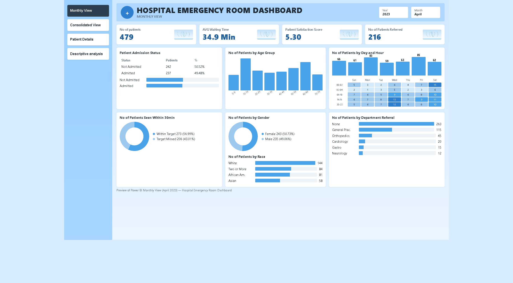

# Hospital Emergency Dashboard

Power BI dashboard for hospital emergency room data — patient volume, wait times, satisfaction, and referrals.

## How to open

1. Install [Power BI Desktop](https://powerbi.microsoft.com/desktop/)
2. Open `Hospital Emergency Dashboard.pbix`
3. Use the left menu to switch pages

## Pages

| Page | What it shows |
|------|----------------|
| Monthly View | KPIs and charts for a selected year/month |
| Consolidated View | Same layout with a date range filter |
| Patient Details | Patient-level table |
| Descriptive analysis | Summary notes |

## April 2023 snapshot (Monthly View)

| Metric | Value |
|--------|-------|
| Patients | 479 |
| Avg waiting time | 34.9 min |
| Satisfaction score | 5.30 |
| Patients referred | 216 |

## What's in this repo

- `Hospital Emergency Dashboard.pbix` — the Power BI report
- `assets/dashboard-monthly-view.png` — screenshot of the Monthly View
- `README.md` — this guide
